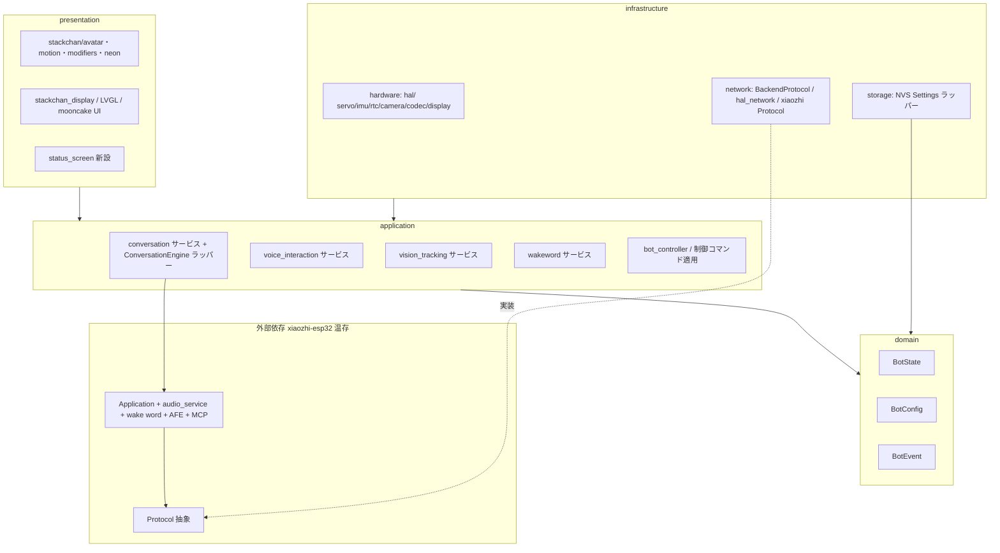

# firmware 責務分離設計（Phase 1 / Issue #2）

本書は `firmware/`（CoreS3 ファームウェア）の責務分離リファクタリングの設計ドキュメントである。
`docs/design-spec.md` §3.3 が示す `domain / application / infrastructure / presentation` の方向に、既存構成を活かしつつ **段階的に** 整理するための設計判断と移行計画を定める。

- 前提資料: `CLAUDE.md`（firmware の制約）、`docs/design-spec.md`（§3.3 推奨構成 / Phase 1）、`docs/repository-analysis.md`（Phase 0 調査）、`docs/adr/0001`〜`0004`
- **本 Phase ではコードを一切変更しない。** 作成するのは本ファイルのみ。
- 記載はファイルパスベース。推測には「（推測）」と明示する。

---

## 1. 目的とスコープ

### 1.1 目的

AI 会話の本体は外部依存 `xiaozhi-esp32` の `Application`（`firmware/xiaozhi-esp32/main/application.cc`）であり、firmware/main はその起動・橋渡し層である（`docs/repository-analysis.md` §2.1, §5b）。
したがって firmware の責務分離とは「**xiaozhi の `Application` / `Protocol` を壊さず、その外側（HAL / stackchan / apps / 設定 / 表情連動 / backend 接続）を design-spec §3.3 のレイヤーへ段階的に整理する**」ことである。

狙い:

- ハードウェア依存・クラウド/backend 通信・Bot 状態・画面描画の責務を分離し、`main.cpp` への処理集中を止める（design-spec §13 保守性 / CLAUDE.md「main.cpp に追加しない」）。
- backend 連携（Phase 3 / Issue #5）の差し込み点を、ADR-0004 の方針（`Protocol` 抽象に backend 用実装を追加）に沿って明確なレイヤー上に置けるようにする。
- クラウド依存（Issue #3）を、ローカル機能と疎結合な形に切り出してから削除できる構造にする。

### 1.2 やること

- 既存 `hal/` を `infrastructure/hardware` に相当する層として **位置づける**（リネームはしない）。
- 新規コードを design-spec §3.3 のレイヤーに従って配置する。
- 既存コードは「触るタイミングで段階的に」新構造へ寄せる。
- 各レイヤーの境界・依存方向・xiaozhi との統合点を図と表で明示する。

### 1.3 やらないこと（明示）

- **xiaozhi 内部（`Application` / `audio_service` / `protocols` / wake word / AFE）の大改造**。ADR-0004 のとおり温存する。
- **一括リネーム・大規模ファイル移動**（CLAUDE.md / design-spec §15）。
- **既存機能の破壊**（画面設定・表情・モーション・既存アプリ・既存ビルド）。
- 本 Phase での実コード変更。Phase 1 の成果物は本設計ドキュメントのみ。
- ESP-IDF への全面移行や音声パイプラインの自前実装（ADR-0004 案 B は不採用）。

---

## 2. 現状構成の要約と問題点

詳細は `docs/repository-analysis.md` を参照。ここでは責務分離に必要な点のみ再掲する。

### 2.1 現状構成（要約）

```
firmware/main/
  main.cpp            起動フロー（mooncake ループ → startXiaozhi）
  hal/                HAL 層（ハード・通信・設定永続化・クラウド連携が混在、約3,500行）
    board/            xiaozhi Board/Application 橋渡し、コーデック、ディスプレイ、カメラ
    drivers/ utils/   各種ドライバ、secret_logic/wifi_connect/ota/motion_detector 等
  stackchan/          アバター描画・モーション・modifiers・neon（presentation 寄り）
  apps/               mooncake ローカルアプリ（launcher/ai_agent/avatar/...、約6,200行）
  assets/             フォント・SFX・バイナリアセット
外部依存:
  firmware/xiaozhi-esp32/   AI 会話本体（Application / Protocol / audio_service / wake word / AFE）
```

- AI 会話の中核 = `xiaozhi-esp32` の `Application`。firmware/main は `hal/board/hal_bridge.cc` で橋渡しする（§2.1, §3.1）。
- `Application` は接続先・認証を持たず、純粋仮想 6 メソッド + 7 コールバックの `Protocol` 抽象 1 点にのみ依存する（§5b.3）。
- クラウド固有処理は `protocols/{websocket,mqtt}_protocol.cc` 実装側と `Ota`（`api.tenclass.net`）にほぼ閉じている（§5b.3, §5b.5）。

### 2.2 問題点

| # | 問題 | 該当 | design-spec / CLAUDE.md の関連 |
|---|---|---|---|
| P1 | HAL 層にハード制御・クラウド通信・設定永続化が混在 | `hal/hal_ws_avatar.cpp` / `hal_account.cpp` / `hal_ezdata.cpp` / `hal_app_center.cpp` がクラウド依存。一方 `hal_servo/imu/rtc` はローカル | §13「ハード依存・API 依存・モデル依存を閉じ込める」 |
| P2 | クラウド依存が複数 HAL / apps に散在 | §6.1 のファイル一覧（WS アバター・Account・AppCenter・EzData） | ADR-0003（削除）、§15「雰囲気で消さない」 |
| P3 | Bot 状態 / 設定 / イベントを表す独立した型が薄い | 設定は NVS `Settings` 直叩き、状態は xiaozhi `DeviceState` に依存 | §13「設定項目を型で管理／グローバル変数に直接依存しない」 |
| P4 | backend 接続設定（Backend URL / Device ID / API Key）が存在しない | §4.2「現状存在しない」 | design-spec §3.1、Phase 3 |
| P5 | 表情・画面制御の入口が WS/BLE 由来 JSON に直結 | `updateAvatarFromJson`（§2.5, §5）、`llm.emotion → SetEmotion`（§5b.4） | backend からの制御へ差し替えたい |

> 補足: `main.cpp` 自体は約63行と小さい（§2.1）。CLAUDE.md の「main.cpp 肥大」は将来肥大させない方針として読み、現状の主たる肥大は `app_setup`（3,101行）など apps 側にある。

---

## 3. 目標レイヤー構成

design-spec §3.3 のレイヤーを実コードへマッピングする。**既存ディレクトリは温存し、新規コードを新構造に置く** 方針（CLAUDE.md）。

### 3.1 レイヤー対応表

| design-spec §3.3 レイヤー | 役割 | 既存コードの対応 | 扱い |
|---|---|---|---|
| **domain** | Bot 状態 / 設定 / イベントの純粋な型・ルール。ハード・通信に非依存 | （現状ほぼ無し。xiaozhi `DeviceState` に間接依存） | **新設**。`BotState` / `BotConfig` / `BotEvent` を薄く定義 |
| **application** | 会話制御・音声・画像追跡・wakeword の各サービス（ユースケース）。`Application` を「会話エンジン」として薄く包む | `app_ai_agent`（起動要求）、`hal_mcp.cpp`（制御ツール本体）、StackChan 更新タスク（`hal.cpp:200`） | **新設 + 段階移行**。xiaozhi `Application` をラップする境界をここに置く |
| **infrastructure/hardware** | マイク・スピーカー・カメラ・ディスプレイ・サーボ等のハード隔離 | `hal/`（servo/imu/head_touch/rtc/io_expander/espnow/audio コーデック/カメラ）、`hal/board/`、`hal/drivers/` | **既存を温存**し infrastructure/hardware と位置づけ。リネームしない |
| **infrastructure/network** | backend 通信。xiaozhi `Protocol` 実装、HTTP/WS クライアント | `hal_network.cpp`、`protocols/`（xiaozhi）、新規 `BackendProtocol` | **新設（backend 用 Protocol）+ 既存 network 温存** |
| **infrastructure/storage** | 設定永続化（NVS） | xiaozhi `Settings`（NVS ラッパー）、`stackchan.cc` の明るさ/音量永続化 | **既存を温存**しラッパーで包む |
| **presentation** | 表情・画面・ステータス描画 | `stackchan/avatar` `motion` `modifiers` `neon`、`hal/board/stackchan_display.cc`、LVGL/mooncake UI | **既存を温存**し presentation と位置づけ |

### 3.2 xiaozhi `Application` の位置づけ

ADR-0004 のとおり、xiaozhi `Application` は **温存する会話エンジン** として扱う。これを application 層の薄いラッパー（仮称 `ConversationEngine` アダプタ）が包み、firmware/main 側の application サービス（会話制御・wakeword・vision・voice）からはラッパー越しに利用する。

- ラッパーは「会話開始 / 停止」「状態変化の購読（`DeviceState` → `BotState` 変換）」「表情イベントの中継（`llm.emotion` → presentation）」を提供する境界とする。
- `Application` 本体・`audio_service`・wake word・AFE・MCP は **無改修**（§5b, ADR-0004 案 A）。

### 3.3 レイヤー境界図（Mermaid）



依存方向（design-spec §4.3 / CLAUDE.md の backend ルールに準拠）:

```
presentation → application → domain
infrastructure → application（が公開する境界）→ domain
（xiaozhi Application は application が薄く包む。Protocol 実装は infrastructure/network）
```

- domain はハード・通信・xiaozhi のいずれにも依存しない純粋型。
- 既存 `hal/` を infrastructure/hardware と読み替えるのは「位置づけ」であり、物理移動は段階移行（§5）で必要時のみ行う。

---

## 4. xiaozhi との統合方針（ADR-0004 準拠）

### 4.1 差し替え点

- backend 連携は **`Protocol` を継承した `BackendProtocol`（WebSocket）を新規実装** し、`Application::InitializeProtocol()`（`application.cc:480-487`）の選択分岐に差し込む（ADR-0004 / §8.1 案 A）。
- `BackendProtocol` は **infrastructure/network** に置く。`Protocol` 純粋仮想 6 メソッド（`Start` / `OpenAudioChannel` / `CloseAudioChannel` / `IsAudioChannelOpened` / `SendAudio` / `SendText`）を実装し、7 コールバック（`OnIncomingAudio` / `OnIncomingJson` / ...）で `Application` に通知する（§5b.3）。

### 4.2 Application を温存する責務境界

| 残す（xiaozhi 温存） | application が包む | 新設（infrastructure/network） |
|---|---|---|
| 状態機械 / event group / 5 音声タスク / AFE / VAD / WakeWord / AEC / Opus / 表情連動（`llm.emotion`）/ MCP | `ConversationEngine` ラッパー（開始・停止・状態購読・表情中継） | `BackendProtocol`（WS）、接続先設定の供給 |

- `Application` は接続先・認証を持たない（§5b.3）。接続先は NVS `websocket` namespace（`url` / `token`）を流用し、Setup / BLE から埋める経路を新設する（§5b.4, ADR-0004）。
- backend 側は xiaozhi 互換 JSON（`hello` / `listen` / `tts` / `stt` / `llm` / `mcp` / `abort`）と Opus を扱う。design-spec §11 のスキーマとの差分は **backend 側 Adapter** で吸収する（ADR-0004「影響」）。firmware 側は xiaozhi スキーマを話すクライアントのまま保つ。

### 4.3 backend 用 Protocol 実装をどの層に置くか

- `BackendProtocol` = **infrastructure/network**（ハード/外部通信の具象）。
- それを `Application` に接続する配線（`InitializeProtocol` への差し込み・接続先供給）は、application 層の `ConversationEngine` ラッパー経由で行い、`main.cpp` には書かない。
- 将来 xiaozhi に無いイベント（Vision / 自発話しかけ、design-spec §6, §11.5）は `mcp` / `custom` または独立 WS で拡張する（ADR-0004「影響」）。

---

## 5. 段階移行計画

CLAUDE.md / design-spec §15 のとおり「既存ビルドを壊さず、小さい PR 単位」で進める。各ステップは独立して In Review にできる粒度とする。

### 5.1 ステップ一覧

| Step | 内容 | 新構造に置くもの | 既存をいつ移すか | 関連 Phase/Issue |
|---|---|---|---|---|
| **S1** | domain 層の新設（純粋型のみ） | `domain/bot_state.h` / `bot_config.h` / `bot_event.h` | 既存は移さない（新規追加のみ） | Phase 1 |
| **S2** | infrastructure/storage ラッパー新設 | NVS `Settings` を包む `config_storage`（backend 設定キー P4 の置き場も定義） | 既存 NVS 直叩きは段階的に置換 | Phase 1 / Phase 3 前提 |
| **S3** | application ラッパー新設 | `ConversationEngine`（xiaozhi `Application` の薄いラッパー）、`bot_controller` 雛形 | `app_ai_agent` の起動要求・`hal.cpp` の起動橋渡しを呼び出し側として接続 | Phase 1 |
| **S4** | presentation 位置づけ + 表情中継の境界化 | 表情適用 I/F（`updateAvatarFromJson` / `llm.emotion` 受けを境界化） | `stackchan/` は移動せず位置づけのみ | Phase 1 / Phase 6 前提 |
| **S5** | クラウド依存の分離・削除（Issue #3） | — | §6.3 A は即削除、B は分離してから | **Phase 1 後半（#3）** |
| **S6** | infrastructure/network に `BackendProtocol` 追加（Issue #5） | `network/backend_protocol`、接続先供給経路 | `InitializeProtocol` に差し込み | **Phase 3（#5）** |

### 5.2 #3（クラウド削除）と #5（backend 接続）の順序

**#3（クラウド削除）を先、#5（backend 接続）を後** とする。

理由:

- §6.3 の分類で **A 即削除可能**（AppCenter / EzData / Account）はローカル機能が依存せず、先に消すとコードサイズ・メモリに余裕が生まれ（ADR-0003 理由）、後続の見通しが良くなる。
- #5 の `BackendProtocol` 差し込み（ADR-0004 案 A）は `Application` 温存が前提なので、クラウド固有の実体である `Ota`（`api.tenclass.net` プロビジョニング, §5b.5）の無効化と、NVS `websocket` を Setup/BLE から埋める経路（§6.3-C の BLE Wi-Fi 設定拡張）の整備を **#3 で先に** 済ませておくと、#5 は接続先を差し替えるだけになる。
- ただし §6.3 **B 分離してから削除**（`hal_ws_avatar` / `app_ai_agent` + `Application`）は、置換先（backend クライアント）が無い状態で消すと AI 会話が壊れる。よって **B のうち `Application` 経路は #5 完了まで削除しない**。#3 では「A の即削除」と「B の分離（WS 通信部の切り出し）」までに留め、`Application` 経路の最終置換は #5 で行う。

順序まとめ:

```
#2(本設計) → #3 前半: A 即削除 + Ota 無効化 + 接続先設定経路の新設
           → #3 後半: B の分離（WS 通信部切り出し。Application はまだ温存）
#5        : BackendProtocol 追加 → InitializeProtocol 差し込み → backend へ接続
```

> 大規模な一括移動は行わない。各 Step で「新構造へ置く範囲」と「既存を移す範囲」を最小化し、PR ごとに既存ビルドが通ること（ESP-IDF 環境がない場合は clang-format + ホストテストのみ、CLAUDE.md）を確認する。

---

## 6. ディレクトリ構成案（firmware/main 配下）

既存ディレクトリ（`hal/` `stackchan/` `apps/` `assets/`）を温存し、**新規コードの置き場所** を design-spec §3.3 に合わせて追加する。

```
firmware/main/
  main.cpp                       既存。処理を追加しない（起動フローのみ）

  domain/                        【新設・S1】純粋型。ハード/通信/xiaozhi 非依存
    bot_state.h                  BotState（design-spec §3.3）
    bot_config.h                 BotConfig（backend URL / device_id / api_key 含む, P4）
    bot_event.h                  BotEvent

  application/                   【新設・S3】ユースケース。xiaozhi Application を薄く包む
    conversation_engine.h        xiaozhi Application ラッパー（開始/停止/状態購読/表情中継）
    bot_controller.h             制御コマンド適用（§11.5 look_at/set_expression 等の受け口）
    voice_interaction_service.h  （Phase 5 で具体化）
    vision_tracking_service.h    （Phase 6 で具体化）
    wakeword_service.h           （Phase 7 で具体化。当面 esp-sr/AFE 維持の抽象）

  infrastructure/                【段階】
    hardware/                    既存 hal/ を位置づけ（リネームしない）。新規ハード抽象はここ
    network/
      backend_protocol.h/.cc     【S6/#5】xiaozhi Protocol 実装（WebSocket）
      backend_client.h           backend HTTP/WS クライアント（Phase 3）
    storage/
      config_storage.h           【S2】NVS Settings ラッパー（既存 NVS を包む）

  presentation/                  【S4・位置づけ】
    face_renderer.h              既存 stackchan/avatar への薄い境界（表情適用 I/F）
    status_screen.h              ステータス描画（新設）

  hal/                           既存（infrastructure/hardware 相当）。温存・段階移行
  stackchan/                     既存（presentation 相当）。温存
  apps/                          既存。#3 でクラウド系 app を削除/分離
  assets/                        既存
```

注:

- design-spec §3.3 は `firmware/src/` 表記だが、本リポジトリの実体は `firmware/main/`。**実体の `firmware/main/` 配下に新設** する（§3.3「既存構成に合わせて調整してよい」に従う）。これは design-spec との表記差であり矛盾ではない（§8 で明記）。
- `hal/` を物理的に `infrastructure/hardware/` へ移動する一括移動はしない。新規ハード抽象のみ `infrastructure/hardware/` に置き、既存は触るタイミングで寄せる。

---

## 7. 守る制約（CLAUDE.md / design-spec §15）

| # | 制約 | 本設計での担保 |
|---|---|---|
| C1 | ハード依存（マイク/スピーカー/カメラ/ディスプレイ/サーボ）を HAL（infrastructure/hardware）に閉じ込める | 既存 `hal/` を infrastructure/hardware と位置づけ、新規ハード抽象もここに限定 |
| C2 | `main.cpp` に処理を追加しない | 新機能は application / infrastructure のモジュールへ。`main.cpp` は起動フローのみ維持 |
| C3 | メモリ制約（PSRAM 8MB / Flash 16MB）。フレームバッファ・音声バッファを複製しない | ラッパーは参照/ハンドル渡し。カメラ/音声は既存パイプライン（§5b.2）を再利用し複製しない |
| C4 | ハード依存処理は Adapter 化、Provider 分岐を if で増やさない | `BackendProtocol` は `Protocol` 抽象の実装として追加（差し替え点 1 箇所） |
| C5 | 既存機能（画面設定・表情・モーション・既存アプリ）を壊さない | `stackchan/` 温存、表情経路は境界化のみ。#3 の B は分離してから削除 |
| C6 | 重い AI 推論を firmware に持ち込まない | application サービスは backend へ委譲（design-spec §2.1） |
| C7 | 動作確認できないハード処理は断定せず TODO 明示 | AEC/バージイン実機検証は未確認（§8）。Kconfig パッチは別 Phase |

---

## 8. リスクと未確認事項

| # | 事項 | 影響 | 対応方針 |
|---|---|---|---|
| R1 | ビルド未確認（本調査環境に ESP-IDF なし、`docs/repository-analysis.md` §9.2 #5） | 全 Step | 各 PR で `idf.py build` を通す。環境が無い場合は「ビルド未確認」と明示し clang-format + ホストテストのみ（CLAUDE.md） |
| R2 | design-spec §3.3 は `firmware/src/`、実体は `firmware/main/` | 構成案の解釈 | 実体に合わせ `firmware/main/` に新設（§6）。表記差であり方針の矛盾ではない |
| R3 | design-spec §11 の API スキーマと xiaozhi スキーマの差分（ADR-0004） | #5 | backend 側 Adapter で吸収。firmware は xiaozhi 互換のまま。design-spec への反映は ADR-0004「影響」で別途 |
| R4 | xiaozhi バージョンアップ追従（パッチ運用、§8.1） | 長期保守 | `Protocol` 差し込みは追加コードに限定し、xiaozhi 本体への改変を最小化 |
| R5 | `secret_logic` 実体（weak スタブのみ、§9.2 #3） | #3 削除範囲 | WS アバター/Account 系専用で AI 会話と独立。削除対象側として扱う（推測を含むため #3 着手時に再確認） |
| R6 | Wi-Fi 認証情報の NVS 保存先（WifiManager 管轄、§9.2 #4） | #3, #5（接続先設定の整合） | backend URL/Device ID 追加時に既存 Wi-Fi 設定と衝突しないキー設計を S2 で確定 |
| R7 | デバイス側 AEC / バージインの実機実用性（§3.2, §5b.6） | Phase 8 | Kconfig `USE_DEVICE_AEC` の depends に StackChan 追加は別パッチ。実機音響分離は未確認（断定しない） |
| R8 | domain 型と xiaozhi `DeviceState` の対応（§5b.1） | S1, S3 | `BotState` は §5b.1 の対応表（Idle/Listening↔UserSpeaking 等）を写像する薄い変換に留め、状態機械を二重に持たない |

---

## 9. ADR との関係

- ADR-0001 / 0003 / 0004（Accepted / Proposed）の方針に準拠する。
- **ADR-0004 は Proposed**。本設計（Issue #2）のレビューをもって Accepted にする想定（ADR-0004「影響」末尾）。
- 本設計で design-spec §3.3 の `firmware/src/` 表記を `firmware/main/` 実体に読み替える点（R2）、#3 を #5 より先にする順序判断（§5.2）は、確定時に必要なら ADR 化する（CLAUDE.md「設計判断は ADR に残す」）。
